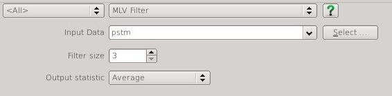
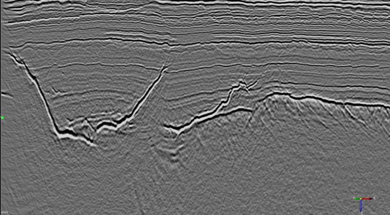
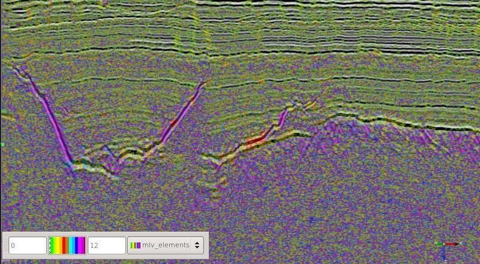

#MLV Filter
##Name
Mean of Least Variance Filter plugin for [OpendTect](http://www.opendtect.org/) - a smoothing filter for seismic data that is kind to structure. This codebase is for use with OpendTect v5.0 and above.

##Contents
-  [Description](#description)
-  [Input Parameters](#input-parameters)
-  [Examples](#examples)
-  [Building and Installation](#building-and-installation)
-  [References](#references)

## Description

This attribute is an implementation of a mean of least variance filter ([Schulze & Pearce,1993](#schulze-and-pearce-1993)) where the analysis elements are all the possible planes through the sample points in the analysis block. This algorithm may be similar to that proposed by [Al-Dossary & Wang (2011)](#al-dossary-and-wang-2011). 

The sample variance for all samples on each analysis element is calculated and the output statistic (average, mean or element index) is output for the element with the least variance. 

The following figure shows the relationship between the geometry of the analysis elements and the element index.

##Input Parameters

This attribute only has 2 parameters:

*   Filter size

    Specifies a cube of samples centred  at the analysis location. Increasing the size will increase the degree of smoothing at the risk of smearing structural features. As the examples below show it may be better to apply multiple passes of a small size filter than a single pass of a larger filter to reduce the risk of artifacts in the output. Opendtect makes it really easy to cascade multiple filter passes.
    
*   Output statistic

    What the filter will output. The options are average, median or the element index. The element index is included for curiosity and quality control. Generally the default "Average" provides the most pleasing output.

##Examples

###Input Data

###3 Trace Running Mix (using Volume Statistics attribute)

###MLV Size 3 Average - 1 pass

###MLV Size 3 Average - 2 passes

###MLV Size 5 Average

###MLV Size 3 Elements over Input

##Building and Installation

These instructions are for Linux/Unix. The plugin should compile and run on Windows but I have not tried or tested it on that platform.

###Building
1. Download the source for the attribute from the [GitHub repository](https://github.com/waynegm/MLVFilterAttrib/archive/master.zip)
2. Use the OpendTect installation manager to install the OpendTect developer packages and install any other packages required for compiling and building code for your operating environment ([Unix](file:///opt/seismic/OpendTect/4.6.0/doc/Programmer/unix.html)).
3. Start OpendTect
4. Select the *Utilities-Tools-Create Plugin Devel. Env.* menu item to create a development work folder (eg /home/*user*/ODWork)
5. Unzip the attribute source zip archive downloaded in step 1 in the development work folder. This will overwrite the CMakeLists.txt in the development work folder and add 2 plugin source folders to the plugin folder.
6. Optionally edit CMakeCache.txt in the development work folder and change Debug to Release
7. Open a terminal, cd to the development work folder and type *cmake .* and then *make*
8. This should create the 2 plugin binary files,libMLVFilterAttrib.so and libuiMLVFilterAttrib.so, in the *bin* folder (eg in *ODWork/bin/lux64/Release/*) and 4 .alo files for the plugin in the root of the development work folder. 

For installation there are 2 alternatives.
###Site Wide Installation
1.  Copy the libMLVFilterAttrib.so and libuiMLVFilterAttrib.so files to the appropriate platform sub folder in the OpendTect installation *bin* folder (eg copy to /opt/seismic/OpendTect/4.6.0/bin/lux64/Release)
2.  Copy the 4 .alo files to the appropriate platform sub folder in the OpendTect installation *bin* folder (eg copy to /opt/seismic/OpendTect/4.6.0/bin/lux64/Release)

###User Installation
On unix/linux it is also possible to install the plugin files in a users *.od* folder

1. Copy the libMLVFilterAttrib.so and libuiMLVFilterAttrib.so files to the appropriate platform sub folder in the users *~/.od/bin* folder (eg copy to /home/user/.od/bin/lux64/Release)
2. Copy the 4 .alo files to the appropriate platform sub folder in the users *~/.od/plugins* folder (eg copy to /home/user/.od/plugins/lux64)

##References

######Schulze and Pearce 1993
[Value-and-criterion filters: a new filter structure based on morphological opening and closing](http://proceedings.spiedigitallibrary.org/proceeding.aspx?articleid=1008684)

######Al-Dossary and Wang 2011
[Structure-preserving smoothing for 3D seismic attributes](http://library.seg.org/doi/pdf/10.1190/1.3627375)